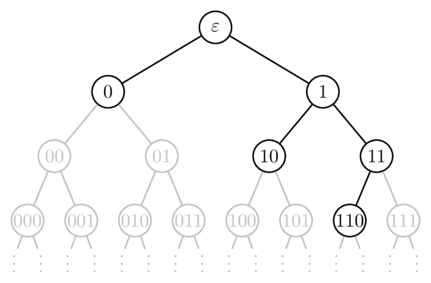

# 5. The Code Space Tree

Before getting to the Kraft&ndash;McMillan inequalities, let's ask a simple but crucial question: _given a list of codeword lengths, when is it actually possible to build a valid code from them?_

## 5.1. Motivation

Not every set of codeword lengths will work; some are impossible to realize as a uniquely decodable (or prefix-free) code. The fundamental limitation comes from the _finite capacity of the code space_, and some combinations just won't fit. To see why, let's start with a few examples before introducing the code space tree.

### 5.1.1. A First Example: An Impossible Assignment

Let $`X = \{a,b,c\}`$ be a source alphabet and let $`Y = \{0,1\}`$ be a binary code alphabet. Consider the problem of constructing a uniquely decodable code $`C : X \to Y^{*}`$ with codeword lengths

```math
L = \{1, 1, 1\}.
```

This would require three distinct codewords, each of length 1.
However, in $`Y^{*}`$ there are only **two** strings of length 1:

```math
\{0,1\}.
```

Therefore, no matter what decoding strategy is used, it is impossible to produce three distinct length-1 codewords. The problem is simply a _lack of available codewords_.

In general, in a $`D`$-ary code, there are at most $`D^{L}`$ distinct strings of length $`L`$. And so, any attempt to assign more than $`L`$ codewords of length $`L`$ is impossible.

### 5.1.2. A Second Example: Interference Between Lengths

Now let $`X = \{a,b,c,d\}`$ be the source alphabet, and keep $`Y = \{0,1\}`$ as the binary code alphabet. Consider now the problem of constructing a prefix-free code $`C : X \to Y^{*}`$ with codeword lengths

```math
L = \{1, 2, 2, 2\}.
```

At first glance this assignment looks plausible:

- We need one codeword of length 1 (two possible choices: $`0`$ or $`1`$),
- and three codewords of length 2 (four possible choices: $`00, 01, 10, 11`$).

However, a problem arises because of the prefix-free requirement. If we choose the length-1 codeword to be $`0`$, then any codeword that begins with $`0`$ cannot be used, thus ruling out $`00`$ and $`01`$. This leaves only $`10`$ and $`11`$ for the three length-2 codewords, which is insufficient. A similar issue arises if we attempted to choose $`1`$ as the length-1 codeword.

Therefore, this length assignment cannot yield a prefix-free code. Moreover, this length assignment cannot yield any uniquely decodable code, because the short codeword blocks too many of the available sequences for the longer codewords.

### 5.1.3. A Third Example: A Valid Assignment

Let $`X = \{a,b,c\}`$ be a source alphabet and $`Y = \{0,1\}`$ the binary code alphabet. Consider constructing a prefix-free code
$`C : X \to Y^{*}`$ with codeword lengths

```math
L = \{1, 2, 2\}.
```

One possible assignment that realizes a prefix-free code with these lengths is:

- $`a \mapsto 0`$
- $`b \mapsto 10`$
- $`c \mapsto 11`$

Here, the length-1 codeword $`0`$ is assigned to symbol $`a`$, while the remaining symbols $`b`$ and $`c`$ are assigned the length-2 codewords $`10`$ and $`11`$, respectively.

No codeword is a prefix of another, and so the code is indeed prefix-free, and therefore also uniquely decodable.

## 5.2. The Code Space Tree

Let $`X`$ be a source alphabet and $`Y`$ a code alphabet. To develop an intuitive understanding of how codewords are organized and how their lengths are constrained, both in prefix-free and universal coding, it is helpful to construct a _universal prefix tree_ over $`Y`$. This infinite rooted tree provides a geometric representation of the set of all finite codewords, where each node corresponds to a unique string in $`Y^{*}`$, and the depth of a node corresponds to codeword length.

For any given coding scheme, the _code space tree_ is the subset of this universal tree consisting of the nodes associated with the actual codewords.

### 5.2.1. The Universal Prefix Tree

A **universal prefix tree** is an infinite rooted tree that represents all possible finite codewords over a given code alphabet $`Y`$. Each node in the tree corresponds to a string in $`Y^{*}`$, with the root representing the empty string $`\epsilon`$. Edges connect a node to its children by appending a single symbol from $`Y`$.

The depth of a node corresponds to the length of the string (codeword) it represents. Each path from the root to a node corresponds to a unique codeword, and the structure naturally captures prefix relationships.

Constructing the universal prefix tree is straightforward:

1. Start with the root node representing the empty string $`\epsilon`$.
2. For each node at depth $`n`$, create $`|Y|`$ children by appending each symbol from the code alphabet $`Y`$ to the node's string.
3. Repeat indefinitely to capture all finite-length codewords.

This tree provides a conceptual framework for visualizing the _entire code space_, showing all possible strings that could be used as codewords. The following image is an example of the universal prefix tree for a binary code alphabet $`Y = \{0,1\}`$:


### 5.2.2. The Code Space Tree

A **code space tree** is the portion of the universal prefix tree actually occupied by the codewords of a particular coding scheme. Unlike the universal tree, which is infinite, the code space tree contains only the nodes along paths leading to codewords in the code.

To construct a code space tree:

1. Start with the root of the universal prefix tree.
2. For each codeword, trace the path from the root to the node representing that codeword.
3. Include all nodes along these paths.
4. Discard nodes that are not on any path to a codeword.

Consider a source alphabet $`X = \{a,b,c\}`$ and a code alphabet $`Y = \{0, 1\}`$, and let $`C : X \to Y^{*}`$ be the code defined by:

- $`C(a) = 0`$
- $`C(b) = 10`$
- $`C(c) = 110`$

The following image shows the code space tree corresponding to $`C`$:



The code space tree provides a _geometric representation of a code_, showing which parts of the universal code space are "used." This perspective is especially helpful when reasoning about codes because it makes constraints on codewords more intuitive.

For example, in a prefix-free code, no node representing a codeword can be an ancestor or descendant of another codeword node. If this were the case, the prefix-free property would be violated. Each codeword occupies a distinct portion of the tree, reflecting both prefix constraints and codeword length limitations.

This view also clarifies the limitations on codeword lengths. Each codeword consumes a fraction of the total tree, and the sum of these fractions cannot exceed one. This observation naturally leads to the Kraft&ndash;McMillan inequality, which formalizes the capacity of the code space.

