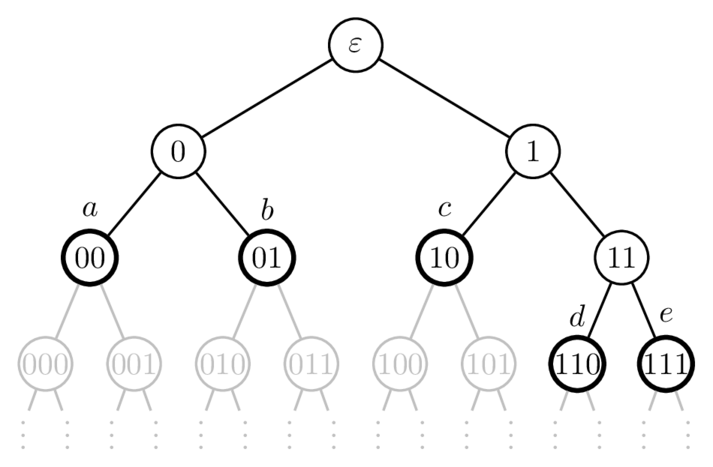
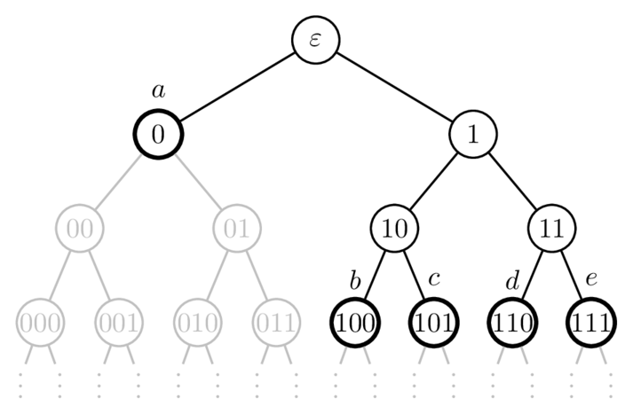

# Huffman Codes and Other Prefix-Free Coding Techniques

Suppose we have a set of symbols $`X = \{x_{1}, x_{2}, \dots, x_{n}\}`$ with known probabilities $`p(x_{i})`$. We want to assign prefix-free codewords $`C(x_{i})`$ the code source symbols $`x_{i}`$ that minimizes the expected codeword length

```math
\bar{L} = \sum_{x \in X} p(x)\,\ell(x).
```

Several algorithms have been developed to solve this problem. In the following sections, we present three well-known approaches: a general greedy algorithm, Shannon&ndash;Fano coding, and the optimal Huffman coding algorithm. While all three of these methods build codewords according to symbol probabilities, they differ in efficiency, simplicity, and optimality.

## 1. Lexicographical Prefix-Free Code Construction

A constructive, greedy approach for building prefix-free codes can be derived from Kraft's theorem. In this method, we first determine the desired codeword lengths (typically based on symbol probabilities). Once we have a given set of codeword lengths that satisfy Kraft's inequality, we can assign codewords iteratively in the universal prefix tree, always choosing the leftmost available node at the appropriate depth. By marking the assigned node and its entire subtree as used, this method ensures that no codeword is a prefix of another, producing a valid prefix-free code with the specified lengths. This method is sometimes referred to as the **lexicographical prefix-free code construction from a given set of codeword lengths** (or simply as the **lexicographical prefix-free code assignment**).

### 1.1. Algorithm

1. Sort the desired codeword lengths in non-decreasing order.
2. Initialize the full universal prefix tree.
3. For each codeword length $`L_{i}`$:
    1. Find the leftmost available node at depth $`L_{i}`$ whose ancestors have not been assigned as codewords.
    2. Assign the codeword corresponding to the path from the root to this node.
    3. Mark the entire subtree rooted at this node as used, so no future codeword can occupy it (ensuring the prefix-free property).
4. Return the set of assigned codewords.

In practice, determining optimal lengths from probabilities is a crucial step. However, thanks to [Shannon's source coding theorem](https://en.wikipedia.org/wiki/Shannon%27s_source_coding_theorem), we have a systematic method to select these lengths. For a source symbol $`x_{i}`$ with probability $`p(x_{i})`$, an approximately optimal integer codeword length $`L_{i}`$ for a $`D`$-ary prefix-free code can be chosen as

```math
L_{i} = \lceil -log_{D}\,p(x_{i}) \rceil.
```

This choice ensures that the codeword lengths satisfy the Kraft inequality, guaranteeing the existence of a prefix-free code. Moreover, these lengths are near-optimal in the sense that the expected codeword length is at most one code symbol longer than the minimum achievable by any prefix-free code.

### 1.2. Example

Suppose we want to construct a binary, prefix-free code for the source symbols $`X = \{a, b, c, d, e\}`$ with probabilities

- $`p(a) = 0.35`$
- $`p(b) = 0.17`$
- $`p(c) = 0.16`$
- $`p(d) = 0.16`$
- $`p(e) = 0.16`$

Using Shannon’s approximation for binary codes ($`D=2`$),

```math
\ell(x_{i}) = \lceil -log_{2}\,p(x_{i}) \rceil,
```

we get the codeword lengths:

- $`\ell(a) = \lceil -\log_{2} 0.35 \rceil = 2`$
- $`\ell(b) = \lceil -\log_{2} 0.17 \rceil = 3`$
- $`\ell(c) = \lceil -\log_{2} 0.16 \rceil = 3`$
- $`\ell(d) = \lceil -\log_{2} 0.16 \rceil = 3`$
- $`\ell(e) = \lceil -\log_{2} 0.16 \rceil = 3`$

This is summarized in the following table:

| $`x`$ | $`p(x)`$ | $`-\log_{2} p(x)`$ | $`\lceil -\log_{2} p(x) \rceil`$ |
|-----|--------|------------------|--------------------------------|
| a   | 0.35   | $`\approx 1.51`$   | 2                              |
| b   | 0.17   | $`\approx 2.56`$   | 3                              |
| c   | 0.16   | $`\approx 2.64`$   | 3                              |
| d   | 0.16   | $`\approx 2.64`$   | 3                              |
| e   | 0.16   | $`\approx 2.64`$   | 3                              |

Applying the lexicographical prefix code assignment to these given codeword lengths, we obtain the following code:

- $`a \mapsto 00`$
- $`b \mapsto 010`$
- $`c \mapsto 011`$
- $`d \mapsto 100`$
- $`e \mapsto 101`$

The following illustration shows how these codewords are selected from the universal prefix tree:


The illustration above shows that this code is not optimal. The codeword 11 remains unused, is shorter than the codewords assigned to $`b`$, $`c`$, $`d`$, and $`e`$, and is not a prefix of any used codeword. Therefore, any source symbol with a codeword of length three could be reassigned to 11, resulting in a code with a smaller expected message length.

The expected codeword length for this code happens to be

```math
\bar{L} = \sum_{x \in X} p(x) \, \ell(x) = 2.65.
```

## 2. Shannon&ndash;Fano Coding

Shannon&ndash;Fano coding is one of the earliest algorithms for constructing binary, prefix-free codes using known source-symbol probabilities. While Shannon&ndash;Fano codes are not optimal and, unlike lexicographical prefix codes, cannot be guaranteed to be near optimal, they remain useful due to their simplicity, ease of computation, and generally efficient code lengths in practice.

### 2.1. Algorithm

1. Sort the symbols in decreasing order of probability.
2. Divide the ordered list into two parts so that the total probabilities of each part are as close as possible.
3. Append the binary digit 0 to the codewords of all symbols in the first part and 1 to those in the second part.
4. Recursively apply steps 2 and 3 to each part until every symbol has a unique codeword.

### 2.2. Example

Let us apply the Shannon&ndash;Fano coding method to the symbols $`X = \{a, b, c, d, e\}`$ with probabilities

- $`p(a) = 0.35`$
- $`p(b) = 0.17`$
- $`p(c) = 0.16`$
- $`p(d) = 0.16`$
- $`p(e) = 0.16`$

Note that these are the same symbols that appeared in the previous example on the lexicographical prefix code assignment.

We begin by sorting the symbols by decreasing probability:

```math
a(0.35),\ b(0.17),\ c(0.16),\ d(0.16),\ e(0.16)
```

Next, we split the full list into two parts so that the total probabilities are as close as possible. The first part contains $`a`$ and $`b`$ with total probability $`0.35 + 0.17 = 0.52`$, and the second part contains $`c`$, $`d`$, and $`e`$ with total probability $`0.16 + 0.16 + 0.16 = 0.48`$. We assign the prefix $`0`$ to the first part and $`1`$ to the second part.

Within the first part, we again split to assign unique codewords:
- $`a`$ has probability $`0.35`$ and is placed in the first sub-group and  assigned $`0`$.
- $`b`$ has probability $`0.17`$ and is placed in the second sub-group and assigned $`1`$.

Appending these to the the prefix $`0`$ from the previous split gives final codewords:

- $`a \mapsto 00`$
- $`b \mapsto 01`$

For the second part, the total probability is $`0.48`$. We aim to split it into two groups with roughly equal total probabilities:
- The first sub-group contains $`c`$ with probability $`0.16`$ and is assigned $`0`$.
- The second sub-group contains $`d`$ and $`e`$ with probability $`0.16 + 0.16 = 0.32`$ and is assigned $`1`$.

Appending these to the prefix $`1`$ from the previous split, we obtain a final codeword

- $`c \mapsto 10`$

and intermediate codewords

- $`d \mapsto 11...`$
- $`e \mapsto 11...`$

Finally, we split the second sub-group to differentiate $`d`$ and $`e`$:

- $`d`$ is assigned $`0`$ resulting in the final codeword of $`110`$.
- $`e`$ is assigned $`1`$ resulting in the final codeword of $`111`$.

And so, the final Shannon&ndash;Fano code is

- $`a \mapsto 00`$
- $`b \mapsto 01`$
- $`c \mapsto 10`$
- $`d \mapsto 110`$
- $`e \mapsto 111`$

This code has expected codeword length

```math
\bar{L} = \sum_{x \in X} p(x) \, \ell(x) = 2.32.
```

The following illustration shows the Shannon&ndash;Fano code space tree for this code:



## 3. Huffman Coding

Huffman coding is a method for constructing optimal, prefix-free codes based on known source-symbol probabilities. Developed by David Huffman, it is historically the first algorithm discovered for building _optimal_ prefix-free codes. Huffman's algorithm is a greedy approach for constructing the code space tree: it begins by representing every source symbol as a leaf node. It then repeatedly combines the two least probable subtrees into a single node, building a binary tree from the bottom up.

### 3.1. Algorithm

1.  List all symbols with their probabilities.
2.  Build a priority queue (or min-heap) of symbols based on probability.
3. While there is more than one node in the queue:
  - Remove the two nodes with the smallest probabilities.
  - Merge them into a new node with probability equal to the sum of the two.
  - Insert the new node back into the queue.
4.  Assign binary digits to each branch (commonly 0 for left and 1 for right) to determine the codewords.

### 3.2. Example

Suppose we have the source symbols $`X = \{a, b, c, d, e\}`$ with probabilities

- $`p(a) = 0.35`$
- $`p(b) = 0.17`$
- $`p(c) = 0.16`$
- $`p(d) = 0.16`$
- $`p(e) = 0.16`$

We initialize leaf nodes for each symbol:

```math
[a(0.35),\ b(0.17),\ c(0.16),\ d(0.16),\ e(0.16)].
```

Combine the least probable codes as follows:
- Combine $`d(0.16)`$ and $`e(0.16)`$:
  -  $`[a(0.35),\ de(0.32),\ b(0.17),\ c(0.16)]`$
- Combine $`b(0.17)`$ and $`c(0.16)`$:
  -  $`[a(0.35),\ bc(0.33),\ de(0.32)]`$
- Combine $`bc(0.33)`$ and $`de(0.32)`$:
  -  $`[bcde(0.65),\ a(0.35)]`$
- Combine $`bcde(0.65)`$ and $`a(0.35)`$:
  -  $`[abcde(1.0)]`$

Now we can assign binary digits to each branch in the tree:

| Symbol | Tree Path ($`L = 0`$ and $`R = 1`$) | Codeword |
|--------|---------------------------------|----------|
| $`a`$    | $`L`$                             | $`0`$      |
| $`b`$    | $`R \rightarrow R \rightarrow L`$ | $`100`$    |
| $`c`$    | $`R \rightarrow R \rightarrow R`$ | $`101`$    |
| $`d`$    | $`R \rightarrow L \rightarrow L`$ | $`110`$    |
| $`e`$    | $`R \rightarrow L \rightarrow R`$ | $`111`$    |

And so, the Huffman code for these symbols is
  - $`a \mapsto 0`$
  - $`b \mapsto 100`$
  - $`c \mapsto 101`$
  - $`d \mapsto 110`$
  - $`e \mapsto 111`$

It follows that the expected codeword length is

```math
\bar{L} = \sum_{x \in X} p(x) \, \ell(x) = 2.3,
```

which is _optimal_ for this set of symbol probabilities.

The following illustration shows the Huffman code space tree for this code:



## 4. Conclusion

We have compared three prefix-free coding methods for the same set of symbols:

| Method             | Expected Codeword Length $`\bar{L}`$ |
|--------------------|--------------------------------------|
| Lexicographical    | 2.65                                 |
| Shannon&ndash;Fano | 2.32                                 |
| Huffman            | 2.30                                 |

## 5. In Relation to the MDL Principle

In the context of Minimum Description Length (MDL) principle, we only care about the lengths of codewords, not their actual bit patterns. Shannon’s formula, $`\ell(x_{i}) \approx -\log_{D} p(x_{i})`$, provides a principled way to assign lengths when the symbol probabilities are known. If the probabilities are unknown, MDL still guides us to minimize the total description length, but the codeword lengths must be inferred from the data rather than derived from Shannon’s formula.

